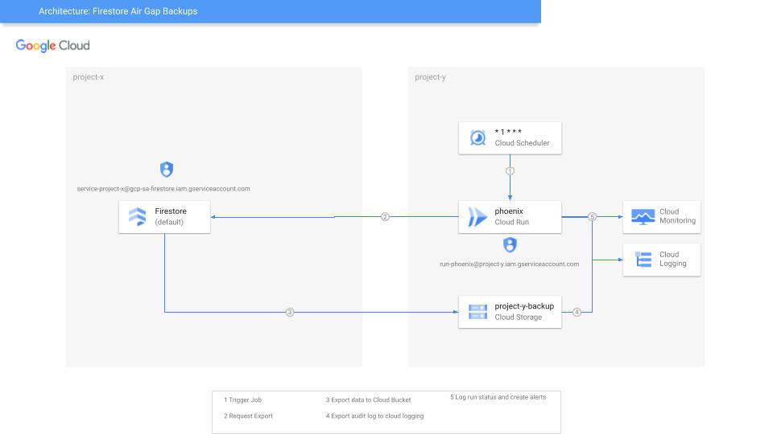
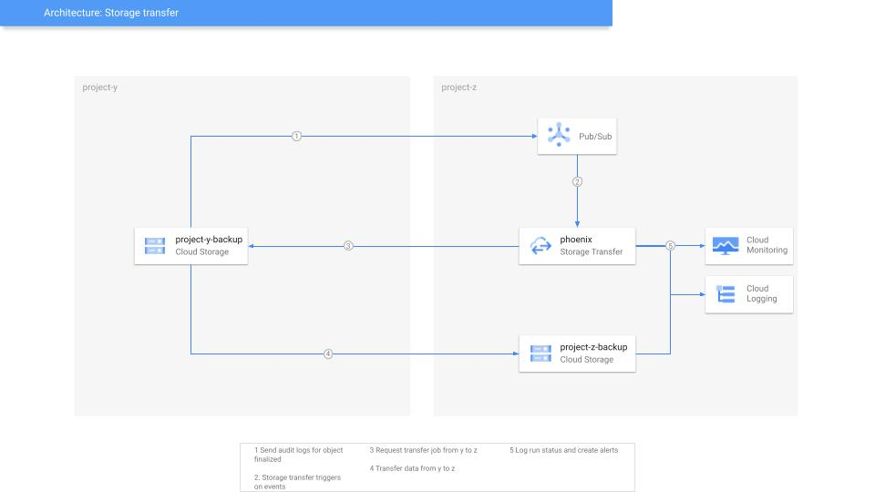

# Project Phoenix

## Table of Contents

- [Description](#description)
- [Organization Principal Access Boundary Policy](#organization-principal-access-boundary-policy)
- [Phoenix](#phoenix)
    - [Directory structure](#directory-structure)
    - [To run the function](#to-run-the-function)
    - [Prerequisites](#prerequisites)
    - [Posting to the API](#posting-to-the-api)
    - [Extending the API](#extending-the-api)

## Description

Phoenix is an application that will manage exports of data from Firestore and CloudSQL to a Google Cloud Storage bucket for DR purposes. The application is
written in Python and uses the FastAPI framework to define the API, and the Google Cloud SDK to interact with the Google Cloud Platform services. The
application is deployed to Google Cloud Run. The application is designed to be run as a scheduled task, and will export data from Firestore and CloudSQL to a
Google Cloud Storage, where it will then have the infrastructure to export the data to a different Google Cloud Platform project for immutable backups for
DR and Ransomware protection.

This project will manage the infrastructure and deployments of Phoenix, and it will create two project, one for the Phoenix application and one for the
Google Cloud Storage bucket where the immutable backups will be stored. It will also create the necessary resources to support that including privileged
access management entitlements for the target project.

### Firestore Export Process



### Datatransfer Process



## Organization Principal Access Boundary Policy

We will enable the Principal Access Boundary (PAB) Policy for the organization. This policy will restrict the access to the DR project to only one google group.
Currently, this feature is not supported by Terraform, so we will use gcloud in the [Makefile](Makefile) to create the policy and the binding. You can also use
the UI or the API to create the policy and the binding.

```bash
make pab
```

Example policy:

```json
{
  "name": "organizations/0123456789012/locations/global/principalAccessBoundaryPolicies/example-policy",
  "uid": "puid_0123456789012345678",
  "etag": "W/\"Gh/PcTdJD/AWHUhPW45kdw==\"",
  "displayName": "Example policy",
  "annotations": {
    "example-key": "example-value"
  },
  "createTime": "2024-01-02T15:01:23Z",
  "updateTime": "2024-01-02T15:01:23Z",
  "details": {
    "rules": [
      {
        "description": "Example principal access boundary policy rule",
        "resources": [
          "//cloudresourcemanager.googleapis.com/projects/example-dev"
        ],
        "effect": "ALLOW"
      }
    ],
    "enforcementVersion": "1"
  }
}
```

Example policy binding:

```json
{
  "name": "organizations/0123456789012/locations/global/policyBindings/example-dev-only-binding",
  "displayName": "Bind policy to all service accounts in example-dev",
  "target": {
    "principalSet": "//cloudresourcemanager.googleapis.com/projects/example-dev"
  },
  "policyKind": "PRINCIPAL_ACCESS_BOUNDARY",
  "policy": "organizations/0123456789012/locations/global/principalAccessBoundaryPolicies/example-dev-only",
  "condition": {
    "title": "Only service accounts",
    "description": "Only enforce the policy if the principal in the request is a service account",
    "expression": "principal.type == 'iam.googleapis.com/WorkspaceIdentity' && principal.subject == 'dr-group@goo.io' "
  }
}
```

More information about PAB can be found
at [https://cloud.google.com/iam/docs/principal-access-boundary-policies](https://cloud.google.com/iam/docs/principal-access-boundary-policies)

## Phoenix

This application provides an API to create backups of different data sources in Google Cloud. Currently, it supports Firestore backups. The API is built using
FastAPI and is designed to be easily extendable for other data sources like Cloud SQL in the future. The function listens for HTTP requests, parses the request
to get the necessary parameters, initiates a Firestore backup job, and waits for the job to complete. It includes detailed logging and error handling to ensure
that any issues can be quickly identified and addressed.

### To run the function

In order to allow for the function to export the data from Firestore, the service account running the function must have the necessary permissions to export the
data. The service account must have the `roles/datastore.importExportAdmin` role. This needs to be set in the project where the Firestore database is located.

```shell
gcloud projects add-iam-policy-binding your-project-id \
--member=serviceAccount:cf-phoenix@your-project-id.iam.gserviceaccount.com \
--role=roles/datastore.importExportAdmin
```

### Directory structure

firestore_backup/  
├── main.py  
├── services/  
│ ├── __init__.py  
│ ├── firestore_backup.py  
├── utils/  
│ ├── __init__.py  
│ ├── logger.py  
├── requirements.txt  
├── README.md  
├── .env

### Prerequisites

- Python 3.9+
- Google Cloud SDK with the necessary permissions to perform backups
- [Google Cloud Firestore Admin SDK](https://pypi.org/project/google-cloud-firestore/)
- Create an .env file in the root directory with the following environment variables:

```bash
BUCKET_NAME=gs://your-target-bucket
```

### Posting to the API

The postbody must contain certain parameters to initiate a backup job. The parameters are as follows:

```json
{
  // Required
  "type": "firestore",
  // Requred
  "project_id": "your-google-cloud-project-id",
  // Required
  "project_number": "your-google-cloud-project-number",
  // Optional based on type, this is the data for the firestore backup
  // If no collections are provided, all collections will be backed up
  // If no database is provided, the default database will be used
  "data": {
    "database": "your-firestore-database",
    "collections": [
      "collection1",
      "collection2"
    ]
  }
}
```

### Extending the API

To add a new data source for backup, follow these steps:

- Create a new service module in the services directory (e.g., services/cloud_sql_backup.py).
- Implement the backup logic in the new service module.
- Add a new type in the `main.py`file, and use the service module to handle the backup.
